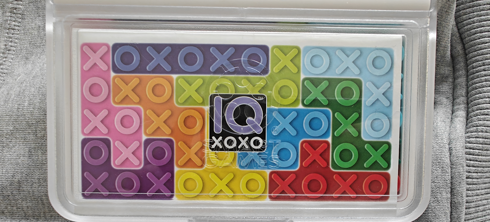
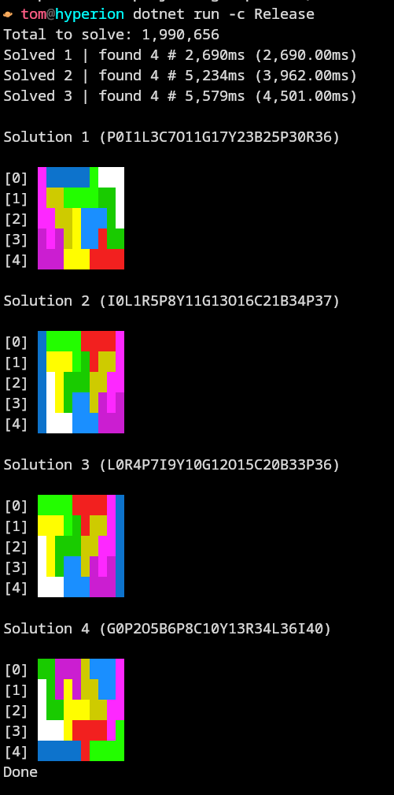

# Get Packin

This is a packing puzzle solver using a bitboard and binary flippin n floppin to exhaustively find solutions for a given set of pieces.

This repo is entirely based around solving the following puzzle:


## How do I run this?

To get started, this should be F5-able off the bat so just hit up 

```csharp
dotnet run -c Release
```

The release config will be crucial as this optimizes the solution before running, the performance increase is mad - I've had solves run in 25s in debug config that can run in ~2.3s in the release config.  
Not a big deal for a few specific permutations but when running the full shaboodle yer talkin over 2 million unique permutations.  
It's a gargantuan computational undertaking so every ms counts.

## Wossitlookliketho?



### Wits it mean?

This is a sample of 3 known permutations with 4 known solutions.  
Apologies for the redudancy but I'll give a wee description of the output in order of mystery
- **The code next to the solution index**: This is a unique code denoting each piece by the first letter of the relevant colour along with the index that the piece has been placed at.  
And important thing to note about this is that each piece is placed using the top left pixel of the bounding rectangle to place the piece, not the piece itself.  
An example of this in action is in Solution 1 (`P0I1L3C7O11G17Y23B25P30R36`); the lime green L piece has a resulting code of _P0_ _I1_ **L3** as the top left of the bounding box is placed at the 4th pixel of the top row, even though there is no associated pixel for that piece due to it's 4x2 size and given orientation.
- **Total to solve**: This is the cartesian product of all possible legal piece permutations
- **The ms timing in brackets**: The average time taken for each solved permutation - not each solution as there may be many solutions per permutation
- **Solved 1, 2, 3 but always found 4?**: Aye mate it's a bug I need to fix with writing the count of a concurrent bag to console instead of having a list local to the solved permutation.

## What is the purpose of this repo ?

Just to see if I could.  
I've been spending a lot of the year with an AI paired programmer and I wanted to ditch the AI completely for this jaunt & I knew I would eventually have to tackle my backtrackin demons if I was trying to exhaustively search for solutions to this puzzle.  
I also had a requirement to use a bitboard to express the board - this was the core thing that hooked my brain, I couldn't stop thinkin about expressing this puzzle as bits.
